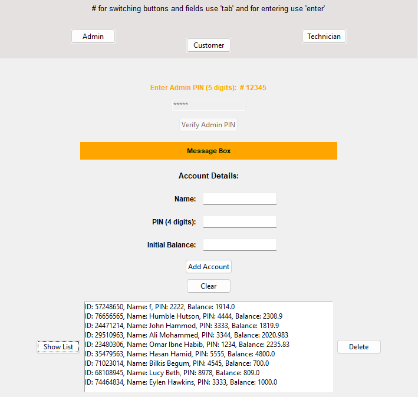
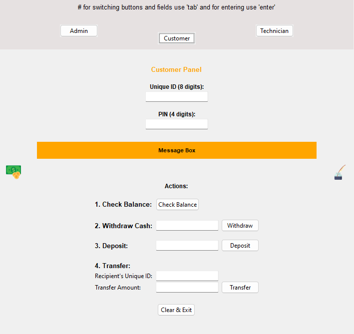
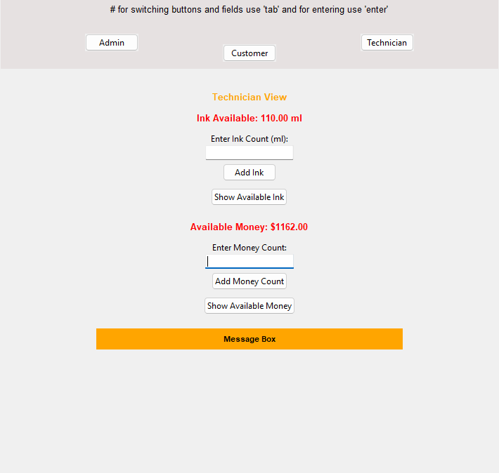

# Project Name

Automated Banking Machine - ABM/ATM

## Table of Contents

- [Introduction](#introduction)
- [Features](#features)
- [Screenshots](#screenshots)
- [Installation](#installation)
- [Usage](#usage)
- [License](#license)

## Introduction

This program is a graphical interface based Automated Teller/Banking Machine concept. It allows users to perform traditional ATM tasks like depositing, withdrawing, transferring, and checking money. It has a Technician widget for handling money and ink status. It also has an Admin section for testing purpose.

## Features

There are three widgets; Admin, Customer, and Technician. Each has its own features.

Admin

- Add accounts
- Delete accounts
- View accounts

Customer: this is the main view. And here the **status** of the **Money** and **Ink** will also be shown in two icons.

- Check balance
- Deposit
- Withdaw
- Transfer

Technician

- Check/add ink
- Check/add money

## Screenshots

*Admin View*

*Customer View*

*Technician View*

## Installation

After downloading the repo the program can be run by executing the **run.py** on a python installed device.

## Usage

Navigations can be done in multiple ways:

- Cursor/touch
- **Tab** for changing focus and **Enter** for enter

Users (customers) can add the 8 digit unique ID and the 4 digit PIN to perform further actions. The account must be in the **accounts.json** prior to that. It can be added in the json file or can be added by accessing the admin panel. Then users can also dive into other options as given.

Users (technicians) can observe system status (money and ink) by simply looking at the main window. If the ink level is below a certain level, the ink bottle will appear empty and likwise for the money. Technicians can login to the panel by entering deafult pass **67890** and manipulate the status. All the system status is stored in **system.json**.

Users (admins) can manipulate accounts data stored in the accounts.json. They can access the panel by entering deafult password **12345**.

## License

This project is licensed under the [MIT License](LICENSE) - see the [LICENSE](LICENSE) file for details.